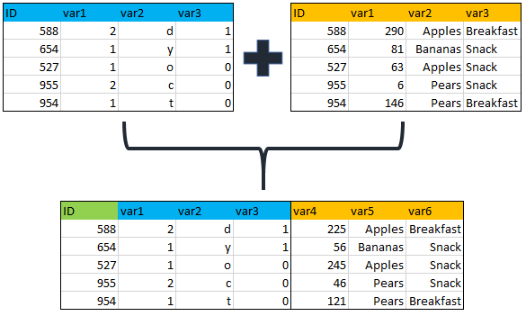

name: toc

```{css, echo=FALSE}
@media print {
  .has-continuation {
    display: block !important;
  }
}
```

```{r setup, include=FALSE}
options(htmltools.dir.version = FALSE)
library(knitr)
opts_chunk$set(
  fig.align="center",  
  fig.height=4, #fig.width=6,
  # out.width="748px", #out.length="520.75px",
  dpi=300, #fig.path='Figs/',
  cache=F#, echo=F, warning=F, message=F
  )
library(data.table)
library(ggplot2)
```

# Table of contents

1. [Introduction](#introduction)

2. [Data](#data)

3. [File paths](#filepath)

4. [Reading in Data](#reading)

---
class: inverse, center, middle
name: introduction

# Introduction

<html><div style='float:left'></div><hr color='#EB811B' size=1px width=796px></html>

---
# Agenda

Today will be our first discussion of data itself and all the issues that can arise when working with data.

There are many such issues that can arise such as reading in data, cleaning data, merging data, and "wrangling" data.

This is by far the hardest and most difficult thing about working with data.
--

- Most of the time you spend doing an analysis will be in this part of the project.

---
class: inverse, center, middle
name: data

# Data

<html><div style='float:left'></div><hr color='#EB811B' size=1px width=796px></html>
---
# Data

- What is "data?"
--

- Data are a set of qualitative or quantitative values of one or more variables.
--

- Data are the outcome of some "data generating process."
--

 - Again, sounds abstract but thinking about how data are generated can be very useful.
--

- While data can come in many different formats, ultimately you'll likely get them in a two-dimensional format similar to an Excel spreadsheet.

```{r, echo=F}
data(mtcars)
head(mtcars)
```

---
# Types of Data Formats

When working with economic data, there are three different types of data you will typically work with:
--

1. Cross-sectional data: data that are a snapshot of "individuals" in one point of time.
 - Example: Data on sales from Walmart on a specific day.
--

2. Time series data: data of a single variable observed over time.
 - Example: US GDP observed quarterly from 2010Q1 to 2020Q4.
--

3. Panel data: A combination cross-sectional and time series data. Panel data are when you have units (eg individuals, firms, countries, etc) observed over time.
 - Example: All countries' GDP observed quarterly from 2010Q1 to 2020Q4.

Note: This list is *not* exhaustive.
--


Also should think about the frequency of the data.
- That is, how frequently are data observed.
--


Common frequencies are yearly, quarterly, weekly, daily, etc.

---
# Challanges with Economic Data

- Most economic data are *observational data*.
- This means that data are generated via observation rather than through experiments.
- One must think very carefully about how the data generating process will affect the way the data are observed.
- Being able to correct for such issues are beyond the scope of the class, but I still want to instill the intuition into y'all.
--


Examples

1. Simultaneity: In the supply and demand model, we think of prices and quantities are determined via an equilibrium process where price determines quantity and quantity determines price. That is, prices and quantities are determined *simultaneously*.
--

2. Selection: When agents can (optimally) choose positions (occupation, major, school, markets, etc), this is what's referred to as *selection*.
--

3. Correlation with unobservables: When something unobservable drives outcomes in the data, we call this *endogeneity*. 

---
class: inverse, center, middle
name: filepath

# File Paths

<html><div style='float:left'></div><hr color='#EB811B' size=1px width=796px></html>

---
# File Paths

To read data into R, you'll need to understand the file path structure of your computer. 
--

- Files in your computer are stored in "directories," more commonly known as folders.
--

- A file path is the path one must follow to find the location of a file on the computer.
--

- Because directories are nested in most operating systems, understanding file paths is pretty easy.
 - Windows Example: `C:\Documents\Newsletters\Summer2018.pdf`
 - Mac Example: `/Users/alexmarsh/Documents/School/Teaching/ECON390`
--

- In R, to get your current "working directory," use the function `getwd()`.
 - The working directory is the directory that R currently has marked as the "default" directory.
--

- To set the working directory, use the function `setwd()` where the argument is the file path to the working directory you would like to change to.

---
# File Path Examples

```{r}
getwd()
list.files()
setwd("/Users/alexmarsh/Documents/")
list.files()
```

--

Note: If you have a Windows machine, the file paths will look different!

---
class: inverse, center, middle
name: reading

# Reading in Data

<html><div style='float:left'></div><hr color='#EB811B' size=1px width=796px></html>

---
# Reading In Files

After understanding file paths, you are ready to read data into R!
--

- The most important thing to understand is that different file types are read in different ways.
--

- "Delimited files" such as CSVs and tab-delimited files can be read in with `read.table()` or its variants like `read.csv()`.
--

 - Care must be taken when knowing if the first line is for the column names (a header) and what type of delimiter the files has.
--

 - However, `fread()` in the `data.table` package takes care of most of these issues.
--

- Sometimes one must read in unstructured data. Beyond the scope of this class but for reference, you will want `readLines()`.
--

- Web data: XML and HTML can be read in using the `XML` package.
--

- Binary Data:
 - For Excel data, need a package: either `xlsx` or `openxlsx`.
 - For the former, use `read.xlsx2()`; for the latter use `read.xlsx()`.
 - For SAS, SPSS, Stata, MATLAB, etc: Use the `foreign` package with the functions `read.ssd()`, `read.spss()`, `read.dta()`, `readMat()` respectively.
 
---
# Web-Based Data

- R has its own web server built in, so some functions can read in data from URLs eg `read.csv()`.
--

```{r, eval=TRUE}
url_stem = "http://www.nber.org/hcris/265-94/"
CMS_data = "rnl_nmrc265_94_2005_long.csv"
data_url  = paste0(url_stem,CMS_data)
cost_data = read.csv(data_url)
head(cost_data)
```
--

- Can also use `download.file()` to download and and save files locally.
--

- One can scrape data from websites to extract data from the XML files.
--

 - I was going to have a lecture on this, but will skip for time.
--

- Can also interact with APIs to extract data from publicly available APIs. 

---
# Combining Data

- Many times, data will come from many different sources and must be combined.
- While you can combine data via row-binding (`rbind()`) or column-binding (`cbind()`), the most challenging and likely version will require a *merge*.
- Merging is when you combine two data sets on a common "key."



---
# Merging

There are some things you should keep in mind when merging data:

1. Data sets are merged two at a time.
2. When merging two data sets, the one "on the left" (or the "x" data set) is the one you keep and the one "on the right" (or the "y" data set) is the data set that is being merged in.
3. The uniqueness of the key one is merging on is important.
 - The Stata merge terminology is very useful: `1:1`, `1:m`, `m:1`, `m:m`.
 - `m:m` merges are almost never recommended. 
4. Need to know what to do with entries that don't match in both data sets.
 - In SQL, these are left joins, right joins, center joins, etc.
 - Check out the `merge()` documentation to see how `R` handles this.
 - The way `R` handles it is simpler, but SQL is pervasive and worth looking into.
5. Keep in mind the size of the data post merge.

---
# Wrangling Data

- Base `R` is not great for wrangling and manipulating data once it is read in.
- Two packages have been developed to help with this: `data.table` and `tidyverse`.
- Both packages are huge and we could spend an entire course discussing the two.
- I would pick a package and learn it well. 
- I feel obliged to introduce both as they are both ubiquitous in the `R`
 community.
- I prefer `data.table` as it's the one I learned first and it is the most similar to `data.frame()` which we have already covered.
- For this lecture and the next, make sure the following packages are installed:
1. `tidyverse`
2. `data.table`
3. `nycflights13`
4. `microbenchmark`
5. `tidyfast`
6. `dtplyr`

---
class: inverse, center, middle

# Next lecture: data.table
<html><div style='float:left'></div><hr color='#EB811B' size=1px width=796px></html>

```{r gen_pdf, include = FALSE, cache = FALSE, eval = TRUE}
infile = list.files(pattern = '.html')
pagedown::chrome_print(input = infile, timeout = 100)
```