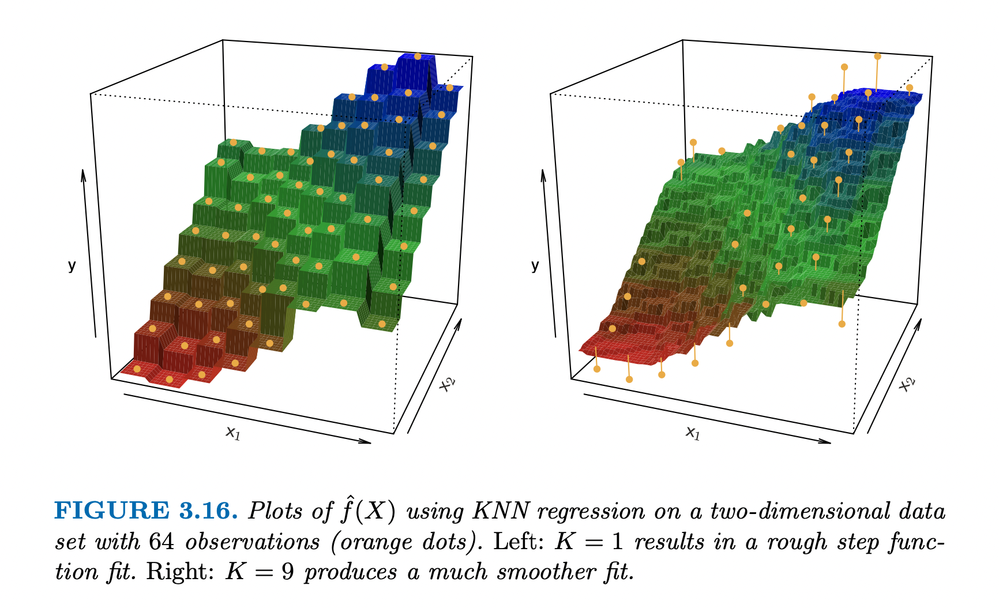
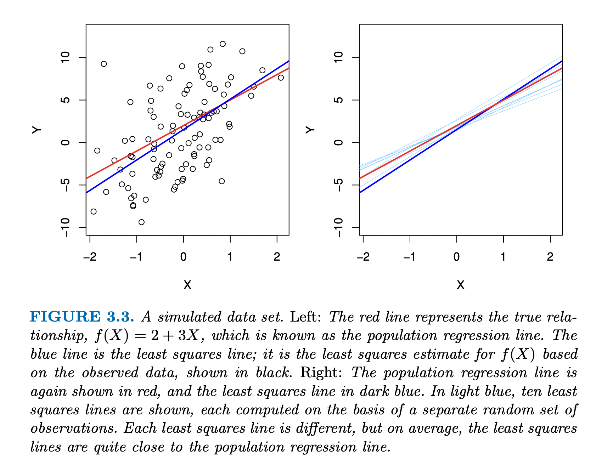

```{r xaringan-themer, include=FALSE, warning=FALSE}
library(xaringanthemer)
style_mono_accent(
  base_color = "#4B9CD3",
  header_font_google = google_font("Fira Sans","600"),
  text_font_google   = google_font("Fira Sans", "300", "300i"),
  base_font_size = "20px",
  text_font_size = "0.9rem",
  code_inline_font_size = "0.9em",
  code_font_size = "0.7rem",
  header_h1_font_size = "2.0rem",
  header_h2_font_size = "1.75rem",
  header_h3_font_size = "1.25rem",
  code_font_google   = google_font("Fira Code"),
  inverse_link_color = "#13294B",
  link_color = "#4B9CD3"
)
data(mtcars)
```


```{css, echo=FALSE}
# CSS for including pauses in printed PDF output (see bottom of lecture)
@media print {
  .has-continuation {
    display: block !important;
  }
}
```

```{r setup, include=FALSE}
# xaringanExtra::use_scribble() ## Draw on slides. Requires dev version of xaringanExtra.

options(htmltools.dir.version = FALSE)
library(knitr)
opts_chunk$set(
  fig.align="center",  
  fig.height=4, #fig.width=6,
  # out.width="748px", #out.length="520.75px",
  dpi=300, #fig.path='Figs/',
  cache=F#, echo=F, warning=F, message=F
  )
library(tidyverse)
library(hrbrthemes)
library(fontawesome)
```


# Table of contents

1. [Introduction](#intro)

2. [Supervised Learning](#sup)

3. [Regression vs. Classification](#regvclass)

4. [Regression](#reg)

 - [K-Nearest Neighbors](#knn)
 - [Least Squares](#ols)

5. [Classification](#class)
 - [K-Nearest Neighbors](#knnclass)
 - [Logistic Regression](#logit)
 
---
class: inverse, center, middle
name: intro

# Introduction

<html><div style='float:left'></div><hr color='#EB811B' size=1px width=796px></html>

---
# Motivation

We recently covered unsupervised learning. Now, we will touch on supervised learning. 

While these methods might be a bit more familiar and easier to grasp, there are so many we could cover. 

Supervised learning is when you have a target variable $y$ and some features of the data/predictors $X$ and you would like to learn some relationship between the two. 

---
class: inverse, center, middle
name: sup

# Supervised Learning

<html><div style='float:left'></div><hr color='#EB811B' size=1px width=796px></html>

---
# Supervised Learning

As mentioned before, supervised learning is when one wants to learn some relationship between target variables and predictors.

> We wish to fit a model that relates the response to the predictors, with the aim of accurately predicting the response for future observations (prediction) or better understanding the relationship between the response and the predictors (inference).

--

Classical examples of supervised learning: 
- Linear regression 
- Logistic regression

Modern examples of supervised learning:
- Generalized additive models
- Boosting
- Trees
- Support vector machines
- Neural networks

---
class: inverse, center, middle
name: regvclass

# Regression vs. Classiciation
<html><div style='float:left'></div><hr color='#EB811B' size=1px width=796px></html>

---
# Regression vs. Classiciation

Data can be either quantitative or qualitative (or categorical).

--

Quantitative data take on numerical values.

Examples:
- Person's age
- Height
- Income

--

Qualitative data take on classes.

Examples:
- Marital status
- Brand of products purchased
- Cancer diagnosis

---
# Regression vs. Classiciation (cont.)

Roughly, regression is for quantitative target variables and classification is for qualitative target variables.

> However, the distinction is not always that crisp. Least squares linear regression (Ch. 3) is used with a quantitative response, whereas logistic regression (Ch. 4) is typically used with a qualitative (two-class, or binary) response. Thus, despite its name, logistic regression is a classification method. But since it estimates class probabilities, it can be thought of as a regression method as well. 

We will cover the basic models used in both situations.

The idea here is no mastery, but to give intuition for when you learn this stuff in other classes.

---
class: inverse, center, middle
name: knn

# K-Nearest Neighbors (KNN)
<html><div style='float:left'></div><hr color='#EB811B' size=1px width=796px></html>

---
# K-Nearest Neighbors

Let's say we would like to predict a value $y_{n+1}$ given $(y_i,x_{1i},...,x_{ki})_{i=1}^{n}$ and a new observation on the set of predictors $(x_{1n+1},...,x_{kn+1})$.

One thing we could do is see which observations $(x_{1n+1},...,x_{kn+1})$ "looks similar to," take the corresponding $y$ variables, can take their mean.

Say we have a prediction point $x_0$ (which might be a vector). We form a *neighborhood* around $x_0$ denoted $\mathcal{N}_K(x_0)$ which contain the $K$ points which are the "closest" to $x_0$. 

So, if say observation 5 ($x_5$) is "close" to $x_0$, then $5 \in \mathcal{N}_K(x_0)$.

Then the prediction of $y$ for $x_0$ denoted $\hat{f}(x_0)$ is

$$\hat{f}(x_0) = \frac{1}{K}\sum_{i\in \mathcal{N}_K(x_0)} y_i$$
All this is saying is the predicted value for $y$ is the average value of the $K$ observations that look most "similar" to $x_0$.


---
# KNN (Cont.)

What is the KNN predictor for if $K = n$ where $n$ is the sample size?

--

What about if $K=1$?

--

> In general, the optimal value for K will depend on the bias-variance tradeoff, which we introduced in Chapter 2. A small value for K provides the most flexible fit, which will have low bias but high variance. This variance is due to the fact that the prediction in a given region is entirely dependent on just one observation. In contrast, larger values of K provide a smoother and less variable fit; the prediction in a region is an average of several points, and so changing one observation has a smaller effect.

---
# What do I mean by close?

How do we determine which observations are "close" to $x_0$?

We need a measure of distance $||x_0 - x_i||$. 

There are many ways to do this, but standard is the Euclidean distance/norm. Say there are $p$ variables in $x$, then 

$$||x_0 - x_i|| = \sqrt{\Big(\sum_{j=1}^{p} (x_{0j}-x_{ij})^2\Big)}$$
For for each observation $i = 1,...,n$, calculate $||x_0 -x_i||$ for each $i$, then pick the observations that result in the $K$ *smallest* values.


---
# Size of K

```{r, echo=FALSE, out.width="90%"}

```

---
# How to choose $K$?

K is a "hyperparameter" just like the $K$ in $K$-means.

One way to choose hyperparameters is via *cross-validation.*

The idea is you "resample" from the training data, reestimate the model, and then evaluate the *mean-squared error*

$$\text{MSE} = \frac{1}{n}\sum_{i=1}^{N}(y_i - \hat{f}(x_i))^2$$
---
#Leave-One-Out Cross-Validation

Let's go over *Leave-One-Out Cross-Validation*

The steps are,
1. Choose a value of $K$.
2. Create a new data set by leaving out the first observation.
3. Estimate the model with this new data set and form the MSE denoted $\text{MSE}_1$.
4. Repeat steps 2 and 3 for every observation in the data set.
5. The cross-validation error is then $CV_{n}(K)=\frac{1}{n}\sum_{i=1}^{n}\text{MSE}_i$.
6. Repeat 1 through 5 for different values of $K$.

The optimal value of $K$ is the one that minimizes $CV_{n}(K)$.

We can use $K$-Fold CV.

---
# $K$-Fold CV

To avoid confusion with $K$-Fold CV and KNN, I will use $K$ for the number of neighbors and $K'$ for the numnber of folds.

The steps are,
1. Choose a value of $K$.
2. Slip the data into $K'$ different non-overlapping sets.
3. Create a new data set by leaving out the data in the first fold.
3. Estimate the model with this new data set and form the MSE denoted $\text{MSE}_1$.
4. Repeat steps 2 and 3 for every fold.
5. The cross-validation error is then $CV_{K'}(K)=\frac{1}{K'}\sum_{i=1}^{K'}\text{MSE}_i$.
6. Repeat 1 through 5 for different values of $K$.

--

Most people suggest using around 10 folds.

---
class: inverse, center, middle
name: ols

# Regression: Linear Regression
<html><div style='float:left'></div><hr color='#EB811B' size=1px width=796px></html>

---
# Linear Regression

The idea behind linear regression is to relate $y_i$ to some collection of predictions $(x_{1i},...,x_{ki})$ where $$y_i = \beta_0 + \beta_1 x_{1i} + ... + \beta_k x_{ki}+\varepsilon_i$$
where $\varepsilon_i$ is some unobservable/explainable noise.

This is learn regression because the model is linear *in the parameters* i.e. the betas.

This is still a linear regression: $$y_i = \beta_0 + \beta_1 x_i + \beta_2 x_i^2 +\varepsilon_i$$

If we can obtain estimates of $(\beta_0,...,\beta_k)$ called $(\hat{\beta}_0,...,\hat{\beta}_k)$, then our learned function is $$\hat{y}_i = \hat{f}(x_{1i},...,x_{ki})=\hat{\beta}_0+\hat{\beta}_1x_{1i}+...+\hat{\beta}_k x_{ki}$$

---
# Linear Regression: Estimation

How do we estimate the betas?

The idea is that we can choose the betas in just a way that it minimizes the distance between the actual $y_i$ and the predicted $\hat{y}_i = \hat{f}(x_{1i},...,x_{ki})$

$$\min_{\beta_0,...,\beta_k} \frac{1}{n}\sum_{i=1}^{n}(y_i - \beta_0 - \beta_1 x_{1i}-...- \beta_k x_{ki})^2$$
We square the difference for two reasons: 
1. To cancel out negative and positive errors,
2. To give more weight to larger differences.

There is a "closed-form" solution to this problem if you know matrix algebra. 

Can also use the optimization methods we talked about in the middle of the class.

---
# Errors vs Residuals

```{r, echo=FALSE, out.width="78%"}

```

---
# Isn't Linear Restrictive?

The idea of restricting $f(x)$ to a linear form might seem really restrictive.
- What if the relationship between $y$ and the $x$'s is really complex and non-linear? Say even as simple as $y_i = \sin(x_i) + \varepsilon_i$?

--

Math to the rescue `r fa('smile')`.

There's a theorem called Taylor's theorem that says any "sufficiently smooth" function can be written as an infinitely long polynomial centered around some point $a$:

$$f(x) = f(a) + f'(a)(x-a) + \frac{f''(a)}{2!}(x-a)^2 + \frac{f'''(a)}{3!}(x-a)^3 + .... $$

--

Notice, anything with an $a$ is a constant, so if we choose $a=0$, then we have $$f(x) = \beta_0 + \beta_1 x + \beta_2 x^2 + \beta_3 x^3 + ...$$ where $\beta_0 = f(0)$, $\beta_1 = f'(0)$, $\beta_2=\frac{f''(0)}{2!}$, and $\beta_3=\frac{f'''(0)}{3!}$.

So if we choose where to truncate the summation, we can get an approximation for the function using linear regression.

---
# Polynomial Curve Fitting

If $f$ has multiple x's, say $x_1$ and $x_2$, then must include all combinations of $x_1,x_1^2,x_1^3,...$, $x_2,x_2^2,x_2^3,...$, and $x_1 x_2$, $x_1^2 x_2$, $x_1^2x_2^2$, etc.

Can get lots of regressors very fast. Also, where to truncate? 

Can use something called LASSO regression to help with these issues. I wish we could cover it here, but check out Chapter 6 of [An Introduction to Statistical Learning](https://web.stanford.edu/~hastie/ISLR2/ISLRv2_website.pdf).

---
# KNN vs Linear Regression

Linear regression is known as a *parametric* model because we have a (finite) set of parameters that we estimate to estimate $f$, whereas KNN is a *nonparametric* model because we are estimating the entire function $f$.

When to use which?

Linear regression will do very well when the functional form selected is "close" to the true relationship.

KNN will do well when the relationship is very complex (and we have a lot of data).

---
class: inverse, center, middle
name: class-knn

# Classification: KNN
<html><div style='float:left'></div><hr color='#EB811B' size=1px width=796px></html>

---
# KNN revisted

For classification, KNN can also be used.

Instead if averaging $y_i$, we can count how many times the neighbors are of the same class:

$$\hat{P}(Y = j| X=x_0) = \frac{1}{K}\sum_{i\in \mathcal{N}_K(x_0)} I[y_i = j]$$

The idea is of the $K$-nearest neighbors, count how many times they are of class $j$ and divide it by $K$ to get the probability $Y_0$ is of class $j$.

---
class: inverse, center, middle
name: class-logit

# Classification: Logistic Regression
<html><div style='float:left'></div><hr color='#EB811B' size=1px width=796px></html>

---
# Logistic Regression

Suppose we have an outcome that is either $0$ or $1$. This can be generalized, but the ideas are the same.

Suppose the probability that the class is $1$ can be specified as $$P(Y=1|X=x) = \frac{e^{\beta_0 + \beta_1 x_1 + ...+\beta_k x_k}}{1+e^{\beta_0 + \beta_1 x_1 + ...+\beta_k x_k}}$$

This can be rooted in a discrete choice model for a more econ-y model, but it can be completely abstracted away from any actual model of behavior. 

The ideas behind the betas is that the influence the probability of being of class 1.

How can we estimate the betas?

---
# Logistic Regression: Estimation

Maximum likelihood: 

We have not covered this yet, but the idea is that a choice of betas implies probabilities of seeing the data. We should choose the betas in such a way that maximizes the "likelihood" of seeing the data.

The probability of seeing one observation from $i$ can be written as $$\Big(\frac{e^{\beta_0 + \beta_1 x_1 + ...+\beta_k x_k}}{1+e^{\beta_0 + \beta_1 x_1 + ...+\beta_k x_k}}\Big)^{I[y_i = 1]}\Big(1-\frac{e^{\beta_0 + \beta_1 x_1 + ...+\beta_k x_k}}{1+e^{\beta_0 + \beta_1 x_1 + ...+\beta_k x_k}}\Big)^{I[y_i = 0]}$$

For all $n$ observations (if they are independent), the sample likelihood is

$$\prod_{i=1}^{n}\Bigg(\frac{e^{\beta_0 + \beta_1 x_1 + ...+\beta_k x_k}}{1+e^{\beta_0 + \beta_1 x_1 + ...+\beta_k x_k}}\Bigg)^{I[y_i = 1]}\Bigg(1-\frac{e^{\beta_0 + \beta_1 x_1 + ...+\beta_k x_k}}{1+e^{\beta_0 + \beta_1 x_1 + ...+\beta_k x_k}}\Bigg)^{I[y_i = 0]}$$
Lastly, if we take the log, we get

$$\sum_{i=1}^{n}{I[y_i = 1]}\log\Bigg(\frac{e^{\beta_0 + \beta_1 x_1 + ...+\beta_k x_k}}{1+e^{\beta_0 + \beta_1 x_1 + ...+\beta_k x_k}}\Bigg)+{I[y_i = 0]}\log\Bigg(1-\frac{e^{\beta_0 + \beta_1 x_1 + ...+\beta_k x_k}}{1+e^{\beta_0 + \beta_1 x_1 + ...+\beta_k x_k}}\Bigg)$$
---
# Logistic Regression: Estimation

Call the above expression $f(\beta)$ where $\beta = (\beta_0,...,\beta_k)$.

Then if we want to maximize the "probability" (likelihood) of seeing the data, we want to solve the following problem $$\max_{\beta} f(\beta)$$
Sorry that this is so abstract; I can't fit the entire expression on one line.

There is no "closed-form" solution to this problem, so we have to use the numerical optimization techniques we talked about.

However, the problem is well behaved.

---
# More than 2 outcomes

Logistic regression can be generalized to more than two outcomes.

The exact details can get complicated, but understand the probabilities look similar, just all the outcomes are summed up on the bottom.

$$P(Y=j |X = x) = \frac{e^{\beta_{0j} + \beta_{1j} x_{1j} + ...+\beta_{kj} x_{kj}}}{\sum_{m=1}^{J}e^{\beta_{0m} + \beta_{1m} x_{1m} + ...+\beta_{km} x_{km}}}$$
Sample log likelihood: 
$$\sum_{j=1}^{J}\sum_{i=1}^{n}{I[y_i = j]}\log\Bigg(\frac{e^{\beta_{0j} + \beta_{1j} x_{1j} + ...+\beta_{kj} x_{kj}}}{\sum_{m=1}^{J}e^{\beta_{0m} + \beta_{1m} x_{1m} + ...+\beta_{km} x_{km}}}\Bigg)$$
Choose betas to solve $$\max_{\beta} \sum_{j=1}^{J}\sum_{i=1}^{n}{I[y_i = j]}\log\Bigg(\frac{e^{\beta_{0j} + \beta_{1j} x_{1j} + ...+\beta_{kj} x_{kj}}}{\sum_{m=1}^{J}e^{\beta_{0m} + \beta_{1m} x_{1m} + ...+\beta_{km} x_{km}}}\Bigg)$$ 

---
class: inverse, center, middle

# Next lecture: Nothing :)
<html><div style='float:left'></div><hr color='#EB811B' size=1px width=796px></html>


```{r gen_pdf, include = FALSE, cache = FALSE, eval = TRUE}
infile = list.files(pattern = '.html')
pagedown::chrome_print(input = infile, timeout = 100)
```
